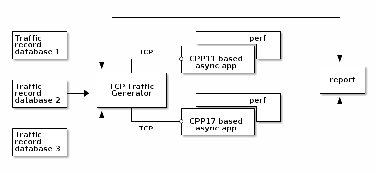

# Asynchronous message handling
This project aims to prove the power of the modern C++ (17) capabilities in
writing high-performance networking code to be used later in 5G gNB networking
services.

## Dependencies
1. cmake;
2. boost.asio.

## Solution architecture


### Synthetic net protocol layout


Note: byte order is the big endian.

Message types:
- Control Message: 0x1001,
- Control Message Acknowledgement: 0x1002,
- Control Message Negative Acknowledgement: 0x1003,
- Control Message Acknowledgement with Checksum: 0x1004,
- Data Message: 0x8001.

Message size limits:
- Control Message: 64 bytes,
- Control Message Acknowledgement: 16 bytes,
- Control Message Negative Acknowledgement: 12 bytes,
- Control Message Acknowledgement with Checksum: 16 bytes,
- Data Message: 64 kilobytes.


### Traffic generator
A tool that shoots with a ton of messages to test target applications.

Example:
```
./traffic_generator -m 1001:64:25 -m 1002:16:25 -m 8001:1500:50 -t10

```
t - time in seconds (default value is 10);
m - message type in the following format (MSG_ID:MSG_SIZE_BYTES:FRACTION).

# Resulting benchmarks
Traffic_generator command options
```
-m 1001:64:25 -m 1002:16:25 -m 8001:1500:50 -t10
```

## CPU:
11th Gen Intel(R) Core(TM) i5-1135G7 @ 2.40GHz   1.38 GHz

## Target PC
VirtualBox Ubuntu 20.04.3 LTS

## Result 1 (max package size 1500 bytes)
Traffic_generator command options
```
-m 1001:64:25 -m 1002:16:25 -m 8001:1500:50 -t10
```
Result (an average value of five samples in nanoseconds)
|CPP11|CPP17|
|:----:|:----:|
|3056|2977|


## Result 2 (max package size 8000 bytes)
Traffic_generator command options
```
-m 1001:64:25 -m 1002:16:25 -m 8001:8000:50 -t10

```
Result (an average value of five samples in nanoseconds)
|CPP11|CPP17|
|:----:|:----:|
|3934|3585|
